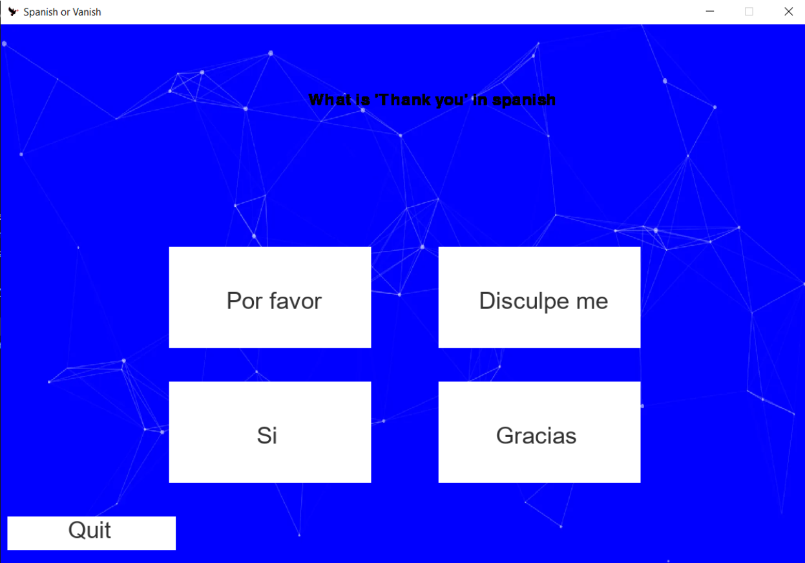

# CS1400-2-Final

## Project Description
---  
Spanish or Vanish
This is a simple game where the user can increase a streak for every day they do a Spanish lesson.
This game has the following units: Basics, Directions, Small Talk, and Food.
The game will display a question in the unit's lesson that they are on and display multiple options. The user has to select the correct one.
This program will be played using Pygame, a popular library for creating games in Python.

## Installation
---
Not used for this class  

## Execution and Usage
---
To use this project one must play the main file with pygame and matplotlib already installed. This will open up a pygame window with options to create a new account, log in, or quit. Once signed in, you can see your streak and the leaderboard composed of the people with the top five streak lengths. You can press the start button to then be able to pick which unit and lesson you want to do. You will take a short quiz on how well you know your Spanish in this lesson's category of concepts. After finishing a lesson, your streak will increase for the day and you can then come back the next day to increase your Spanish langauge understanding.

  

## Used Technologies
---
+ Pygame
`pip install pygame`
+ Matplotlib
`pip install matplotlib`  

## Current Features
---
+ First feature I am proud of is using pygame and making it work
+ Second feature I am proud of is making text input for pygame
+ Third feature I am proud of is making sounds play when certain things happen

## Contributions
---
Not used for this class  

## Contributors
---
+ Ms. LaRose - Debugging
+ Copilot - Debugging and general coding
+ Documentation of Libraries - Used to figure out how to use the libraries
+ Google AI Overview - It helped create the text inputting

## Author's Information
---
+ Cecily Strong-
  I am an ametuer programmer with an interest in learning more. I love math and solving puzzles, and intend to apply these interests in my programs. I have been programming for around a year and have graduated a CS 1400 class.
+ Luke Murdock-
  The senior programmer of this project is Luke Murdock and he is a student at UCAS, currently taking a programming class and creating projects like this one to help him learn python and the basics of programming. He mostly enjoys coding, expecially when it doesn't have many bugs and has a fun end product. He enjoys lots of other things including reading and playing games, including video games. He thinks it would be fun to eventually make some sort of actual game in the future if he ever gets the oppurtunity.  
+ Fairus De La Cruz-
  I am an intermediate programmer interested in learning more. I also want to be a game developer, and I am making some games at the moment. I mainly make 3d games and I will learn on how to make some 2d. email: fairus.delacruz@ucas-ede.net
+ Tate Morgan-
  I am an intermediate programmer wishing to learn new programming languages. I love puzzles and challenges and try to make little projects with my friends.
## Change Log
---
Not used for this class  

## License
---
Not used for this class  
